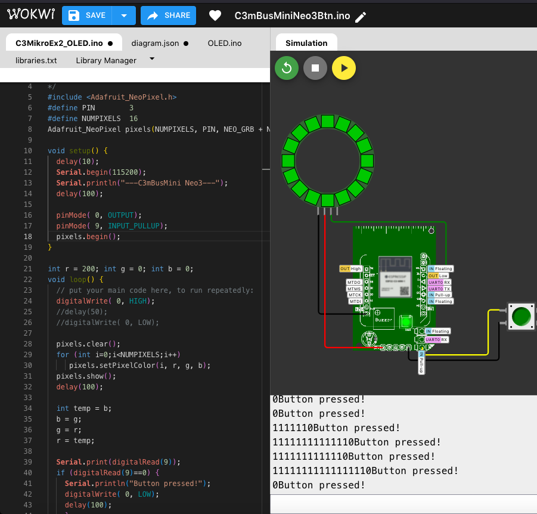

### Wokwi simulation w/ C3mBusMini Custom Board 

  
   
 

---

### Wokwi custom board (mini how-to) 

  - Go WokWi [ESP32C3 Starter page](https://wokwi.com/projects/new/esp32-c3)  
  - In the code editor, hit "F1", "Load custom board file...", select the board folder!  
  - Update Diagram.json  
    Change "parts", "type":"xxxxxxxxx" to "type":"wokwi-custom-board"  
    Change "connections", "esp:TX" to "esp:TX21"; "esp:RX" to "esp:RX20"; _(board drawing will change to C3mBus!)_
          
  - Update Sketch.ino  
          
  - Run the simulator  

  
---

### Reference

[Wokwi custom board](https://github.com/wokwi/wokwi-boards) How to load custom board on Wokwi project?  
[Wokwi Simulation](https://wokwi.com/) Simulate IoT Projects in Your Browser. 

