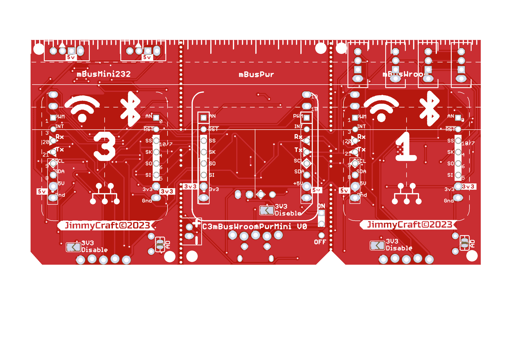

The circuit drawing, PCB and gerber files

### 0818 Changes: 
  - Add LiPo battery charger  
  - Add Groove I2C/UART connectors (Wroom)  
  - Change Wroom/Mini USB-micro to 2.54mm adapter  
    
  
   
